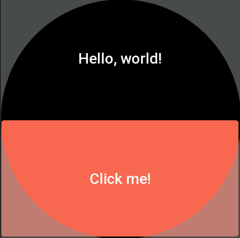
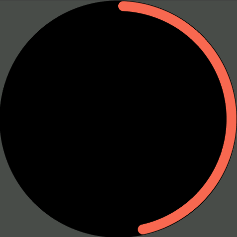
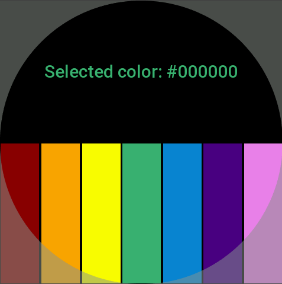
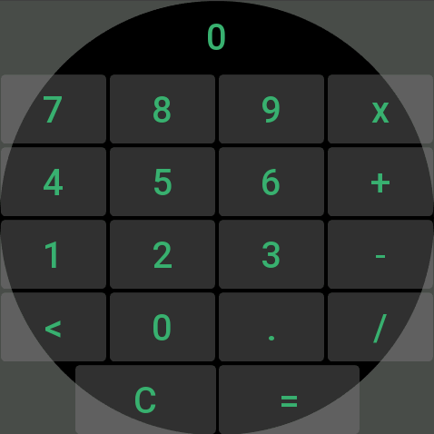

# AutoGUI: Rapid GUI Prototyping for ZeppOS
AutoGUI is a simple and easy-to-use library for creating graphical user interfaces (GUIs) with auto-positioning for ZeppOS. It superseeds the official Widgets approach and provides a set of classes for creating various types of widgets, such as text, buttons, images, circles, arcs, filled rectangles, and stroked rectangles. AutoGUI also supports event handling for widgets, allowing you to attach event listeners for 'click up' and 'click down' events.

## Installation
Clone the repository or install with npm (later).

## Usage
Here are a few basic examples of how to use AutoGUI:

## Example #1 (Hello, World):
```javascript
import AutoGUI from '../autogui/auto-gui';
const gui = new AutoGUI();

// add a text widget
const my_text = gui.text("Hello, world!");

// add a new row for the next widget
gui.newLine();

// add a button widget with a click event
gui.button("Click me!", () => { 
    // update the text widget on button click
    my_text.update({ text: "Button clicked!" }); 
});

// Finally render the GUI
gui.render();
```

## Result


## Example #2 (Rotating Arc):
```javascript
this.arc = gui.arc(); // gui.arc(0, true);

setInterval(() => {
  temp_angle = (temp_angle + 5) % 360;
  // readjust angle based on the coordinate system
  let end_angle = temp_angle;
  if (!this.arc.use_original_coordinates) {
    end_angle -= 90;
  }
  this.arc.update({ end_angle: end_angle });
}, 100);

gui.render();
```

## Result


## Example #3 (Color Picker):
```javascript
const colors_arr = [COLOR_RED, COLOR_ORANGE, COLOR_YELLOW, COLOR_GREEN, COLOR_BLUE, COLOR_INDIGO, COLOR_VIOLET];
this.txt_selected_color = gui.text("Selected color: #000000");

gui.newLine();

for (const color of colors_arr) {
  const rect = gui.fillRect(color);
  rect.onClickUp(() => {
    sound.play();
    this.txt_selected_color.update({ text: "Selected color: " + color.toString(16) });
  });
}

gui.render();
```

## Result


## Example #4 (Calculator):
```javascript
// define calculator's layout
const btn_layout_arr = [ 
  "7", "8", "9", "x", "n", 
  "4", "5", "6", "+", "n", 
  "1", "2", "3", "-", "n", 
  "<", "0", ".", "/", "n",
];
// draw the text field with a "remove" button
this.my_text = gui.text("0");
gui.newLine();
// draw the buttons
for(let i = 0; i < btn_layout_arr.length; i++){
  if (btn_layout_arr[i] === "n"){
    gui.newLine();
  } else {
    gui.button(btn_layout_arr[i], ()=> onBtn(btn_layout_arr[i], this.my_text, sound));
  }
}
// last line/row
gui.spacer();
gui.button("C", ()=> onBtn("C", this.my_text, sound));
gui.button("=", ()=> onBtn("=", this.my_text, sound));
gui.spacer();
// specify layout for the buttons on the last row, in %
// [ 17 ] [   33   ] [   33   ] [ 17 ]
gui.lineLayout(17, 33, 33, 17); 

// finally render the whole gui
gui.render();
```

## Result


For more detailed examples and usage instructions, please see the `autogui-examples` folder.

#### TextWidget, ButtonWidget, ImageWidget, CircleWidget, ArcWidget, FillRectWidget, StrokeRectWidget
These classes inherit from the Widget class and represent specific types of widgets. They each have their own render() method which renders the widget on screen.

### AutoGUI
The main class for creating GUIs.

### constructor()
Creates a new GUI system.

### lineLayout(...percentages)
Sets layout percentages for each line in GUI system.

### removeWidget(widget)
Removes a specific widget from GUI system.

### newLine()
Adds a new line in GUI system.

### text(text)
Adds a text element in GUI system.

### spacer()
Adds a spacer in GUI system.

### button(text, click_func)
Adds a button in GUI system.

### image(src)
Adds an image in GUI system.

### circle(color)
Adds a circle in GUI system.

### arc(end_angle, use_original_coordinates)
Adds an arc in GUI system.

### fillRect(color)
Adds a filled rectangle in GUI system.

### strokeRect(color)
Adds a stroked rectangle in GUI system.

### render()
Renders all widgets on screen.
