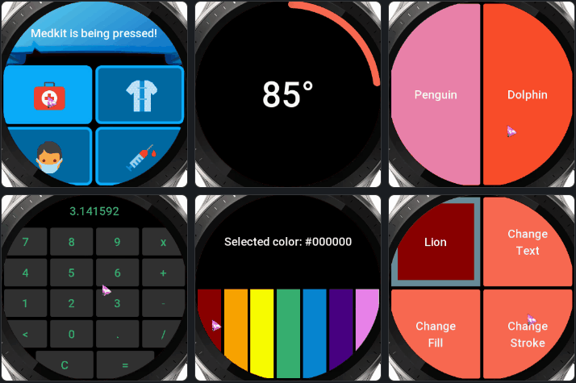
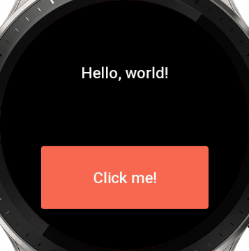
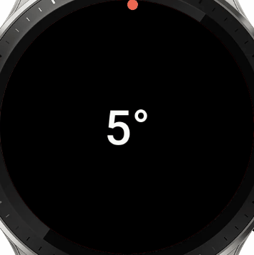
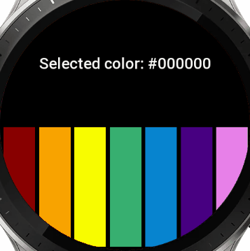
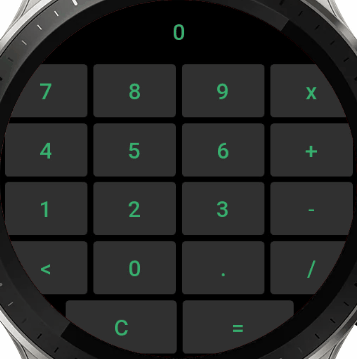
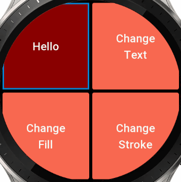
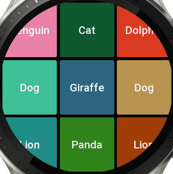
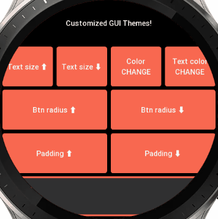
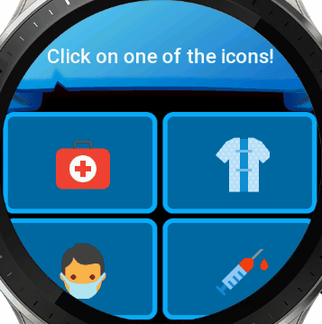

# AutoGUI: Rapid GUI Prototyping for ZeppOS


AutoGUI is a simple and easy-to-use library for creating graphical user interfaces (GUIs) with auto-positioning for ZeppOS. It extends the official Widgets approach and provides a set of classes for creating various types of widgets, such as text, buttons, images, circles, arcs, filled rectangles, and stroked rectangles. AutoGUI also supports event handling for widgets, allowing you to attach event listeners for 'onRelease' and 'onPress' events.

## ⚡️ Quickstart
### AutoGUI for ZeppOS 2.0+ [link](https://github.com/silver-zepp/zeppos-autogui/blob/master/autogui/v2/autogui.js)
`npm i @silver-zepp/autogui`
### AutoGUI for ZeppOS 1.0 [link](https://github.com/silver-zepp/zeppos-autogui/blob/master/autogui/v1/autogui.js)
`npm i @silver-zepp/autogui@legacy`

## Usage
Here are a few basic examples of how to use AutoGUI:

## 💡Example #1 (Hello, World):

```javascript
import AutoGUI from 'auto-gui';
const gui = new AutoGUI();

// add a text widget
const my_text = gui.text("Hello, world!");

//split the line
gui.newLine();

// add a button widget with a click event
gui.button("Click me!", () => {
    // update the text widget on button click
    my_text.update({ text: "Button clicked!" });
});

// finally render the GUI
gui.render();
```

## 💡Example #2 (Rotating Arc):

```javascript
// globally increase the text size for all widgets
AutoGUI.SetTextSize(90);

// create a group that contains an arc and the text in the middle
gui.startGroup();
  this.arc = gui.arc(); // gui.arc(0, true);
  this.text = gui.text("0");
gui.endGroup();

setInterval(() => {
  temp_angle = (temp_angle + 5) % 360;

  // readjust angle based on the coordinate system
  let end_angle = temp_angle;
  if (!this.arc.use_original_coordinates) {
    end_angle -= 90;
  }

  // update the text and the arc with each tick
  this.arc.update({ end_angle: end_angle });
  this.text.update({ text: temp_angle + '°' });
}, 100);

gui.render();
```

## 💡Example #3 (Color Picker):

```javascript
const colors_arr = [COLOR_RED, COLOR_ORANGE, COLOR_YELLOW, COLOR_GREEN, COLOR_BLUE, COLOR_INDIGO, COLOR_VIOLET];
// create a modifiable text field
this.txt_selected_color = gui.text("Selected color: #000000");

gui.newLine();

for (const color of colors_arr) {
  // create a fill rect object
  const rect = gui.fillRect(color);

  // assign "on release" actions
  rect.onRelease(() => {
    sound.play();
    this.txt_selected_color.update({ text: "Selected color: #" + color.toString(16) });
    rect.update({ color: color }); // reset the rect color
  });

  // assign "on press" action: dim the rect color by 30%
  rect.onPress(() => { rect.update({ color: multiplyHexColor(color, 0.7) }) }); 
}

gui.render();
```

## 💡Example #4 (Calculator):

```javascript
// define calculator's layout
const btn_layout_arr = [ 
  "7", "8", "9", "x", "n", 
  "4", "5", "6", "+", "n", 
  "1", "2", "3", "-", "n", 
  "<", "0", ".", "/", "n",
];
// draw the text field
this.my_text = gui.text("0");

gui.newLine();

// draw the buttons
for(let i = 0; i < btn_layout_arr.length; i++){
  if (btn_layout_arr[i] === "n"){
    gui.newLine();
  } else if (btn_layout_arr[i] === " ") {
    gui.spacer();
  } else {
    gui.button(btn_layout_arr[i], ()=> onBtn(btn_layout_arr[i], this.my_text, sound));
  }
}

// last line/row
gui.spacer();
  gui.button("C", ()=> onBtn("C", this.my_text, sound));
  gui.button("=", ()=> onBtn("=", this.my_text, sound));
gui.spacer();

// specify layout for the buttons on the last row, in %
// [ 17 ] [   33   ] [   33   ] [ 17 ]
gui.lineLayout(17, 33, 33, 17); 

// finally render the whole gui
gui.render();
```

## 💡Example #5 (Nested Widgets):

```javascript
// create the group
gui.startGroup();         
  // store references to the required widgets        
  const fill    = gui.fillRect(COLOR_RED);
  const text    = gui.text("Hello"); 
  const stroke  = gui.strokeRect(COLOR_BLUE);
// close the group  
gui.endGroup();     

// update group widget's individual elements on button clicks
gui.button("Change\nText", ()=> { text.update({ text: randomAnimalName() }) });

gui.newLine();

gui.button("Change\nFill", ()=> { fill.update({ color: randomHex() }); });
gui.button("Change\nStroke", ()=> { stroke.update({ color: randomHex(), line_width: 16 }) });

// render the GUI
gui.render();
```

## 💡Example #6 (Auto Reconstruction):

```javascript
// create 9 widgets across 3 rows (rubix' cube style)
for (let i = 0; i < 3; i++) {
  for (let j = 0; j < 3; j++) {
    // create the button and set to remove itself when clicked, apply random color and text
    const btn = gui.button(randomAnimalName(), ()=> btn.remove(), { normal_color: randomHex() } );
  }
  if (i < 2) { // don't create a new line after the last row
    gui.newLine();
  }
}

// render the GUI
gui.render();
```

## 💡Example #7 (Custom Themes):

```javascript
AutoGUI.SetTextSize(16);  

gui.text("Customized GUI Themes!");

gui.newLine(); // ---

gui.button("Text size ⬆️", ()=> { AutoGUI.SetTextSize(AutoGUI.GetTextSize() + 5); gui.render(true); });
gui.button("Text size ⬇️", ()=> { AutoGUI.SetTextSize(AutoGUI.GetTextSize() - 5); gui.render(true);});
gui.button("Color\nCHANGE", ()=> { AutoGUI.SetColor(randomHex()); gui.render(true);  });
gui.button("Text color\nCHANGE", ()=> { AutoGUI.SetTextColor(randomHex()); gui.render(true);  });

gui.newLine(); // ---

gui.button("Btn radius ⬆️", ()=> { AutoGUI.SetBtnRadius(AutoGUI.GetBtnRadius() + 10); gui.render(true);});
gui.button("Btn radius ⬇️", ()=> { AutoGUI.SetBtnRadius(AutoGUI.GetBtnRadius() - 10); gui.render(true); });

gui.newLine(); // ---

gui.button("Padding ⬆️", ()=> { AutoGUI.SetPadding(AutoGUI.GetPadding() + 5); gui.render(true); });
gui.button("Padding ⬇️", ()=> { AutoGUI.SetPadding(AutoGUI.GetPadding() - 5); gui.render(true); });

gui.newLine(); // ---

gui.startGroup();
  // the color of this widget won't change
  gui.fillRect(multiplyHexColor(COLOR_WHITE, 0.2)); 
  // while this one will, as it wasn't manually specified
  gui.strokeRect();
gui.endGroup();

// render the gui
gui.render();
```

## 💡Example #8 (Advanced Rich GUI):

```javascript
// create a text field group at the top (background image + text)
gui.startGroup(); 
  gui.image("/icons/text-field.png");
  const text_field = gui.text("Click on one of the icons!", { color: COLOR_WHITE });
gui.endGroup();

// split the line
gui.newLine();

// describe the buttons
const buttons_arr = [
  "Medkit",
  "Gown",
  "Mask",
  "Syringe"
];

// create the button groups with each containing a button with an image, stroke and fill rect
// assign "on press" and "on release" events 
for (let i = 0; i < buttons_arr.length; i++) {
  const button_name = buttons_arr[i];
  const text_on_press = `${button_name} is being pressed!`;
  const text_on_release = `${button_name} was released!`;
  const src = `icons/${button_name.toLowerCase()}-96.png`;
  
  gui.startGroup();

    const fill = gui.fillRect(multiplyHexColor(COLOR_BLUE, 0.8), { radius: 16 });
    gui.image(src, { auto_scale: false });
    const rect = gui.strokeRect(multiplyHexColor(COLOR_BLUE, 1.3), { line_width: 6, radius: 16 });
    
    // attach events to the last widget in the group (important)
    rect.onPress(() => { 
      text_field.update({ text: text_on_press });
      fill.update({ color: multiplyHexColor(COLOR_BLUE, 1.3) });
    });
    rect.onRelease(() => { 
      text_field.update({ text: text_on_release });
      fill.update({ color: multiplyHexColor(COLOR_BLUE, 0.8) }); 
    });

  gui.endGroup();

  // add a new line after every two buttons
  if (i % 2 === 1) {
    gui.newLine();
  }
}

// render the GUI
gui.render();
```

For more detailed examples and usage instructions, please see the `autogui-examples` folder.

#### TextWidget, ButtonWidget, ImageWidget, CircleWidget, ArcWidget, FillRectWidget, StrokeRectWidget
These classes inherit from the Widget class and represent specific types of widgets. They each have their own render() method which renders the widget on screen.

## AutoGUI API Reference

### lineLayout(...percentages)
Set layout percentages for each line in GUI system.
- **percentages**: The layout percentages for each line in GUI system.

### text(text, options = {})
Add a text element in GUI system.
- **text**: The text to display.
- **options**: Optional parameters for the text.
- Returns: The created widget.

### button(text, click_func, options = {})
Add a button in GUI system.
- **text**: The text to display on the button.
- **click_func**: The function to execute when the button is clicked.
- **options**: Optional parameters for the button.
- Returns: The created widget.

### image(src, options = {})
Add an image in GUI system.
- **src**: The source URL of the image.
- **options**: Optional parameters for the image.
- Returns: The created widget.

### circle(color, options = {})
Add a circle in GUI system.
- **color**: The color of the circle.
- **options**: Optional parameters for the circle.
- Returns: The created widget.

### arc(end_angle, use_original_coordinates, options = {})
Add an arc in GUI system.
- **end_angle**: The end angle of the arc.
- **use_original_coordinates**: Whether to use original coordinates for the arc.
- **options**: Optional parameters for the arc.
- Returns: The created widget.

### fillRect(color, options = {})
Add a filled rectangle in GUI system.
- **color**: The color of the rectangle.
- **options**: Optional parameters for the filled rectangle.
- Returns: The created widget.

### strokeRect(color, options = {})
Add a stroked rectangle in GUI system.
- **color**: The color of the rectangle's stroke.
- **options**: Optional parameters for the stroked rectangle.
- Returns: The created widget.

### newLine()
Add a new line in GUI system. 

### spacer()
Add a spacer in GUI system. 

### startGroup()
Start a new group of widgets. This method creates a new GroupWidget, adds it to the GUI system, and sets it as the current group. This allows subsequent widgets to be added to this group, enabling nested widgets.
- Returns: The current AutoGUI instance, allowing for method chaining.

### endGroup()
End the current group of widgets. This method clears the current group. If there is no current group, it logs an error message.

### render(forced = false)
Renders all widgets on the screen. This method calculates the layout of the widgets based on their specified or default percentages, and then renders each widget at its calculated position. If a widget needs an update or if the 'forced' parameter is set to true, the widget is re-rendered.
- **forced**: If true, all widgets are forcibly re-rendered regardless of whether they need an update.

### removeWidget(widget)
Remove a specific widget from GUI system.
- **widget**: The specific widget to remove from GUI system.

### static SetPadding(value)
Set the padding value.
- **value**: The new padding value.

### static GetPadding()
Get the current padding value.
- Returns: The current padding value.

### static SetColor(value)
Set the default color value.
- **value**: The new default color value.

### static GetColor()
Get the current default color value.
- Returns: The current default color value.

### static SetTextColor(value)
Set the default text color value.
- **value**: The new default text color value.

### static GetTextColor()
Get the current default text color value.
- Returns: The current default text color value.

### static SetTextSize(value)
Set the default text size.
- **value**: The new default text size.

### static GetTextSize()
Get the current default text size.
- Returns: The current default text size.

### static SetText(value)
Set the default text.
- **value**: The new default text.

### static GetText()
Get the current default text.
- Returns: The current default text.

### static SetBtnRadius(value)
Set the default button radius.
- **value**: The new default button radius.

### static GetBtnRadius()
Get the current button radius.
- Returns: The current button radius.

## Helpers

### multiplyHexColor(hex_color, multiplier)
Multiplies/Divides each component (red, green, blue) of a hexadecimal color by a multiplier.
- **hex_color**: The hexadecimal color to multiply.
- **multiplier**: The multiplier/divider. [example 1]: 1.3 = +30% [example 2]: 0.7 = -30%.
- Returns: The resulting hexadecimal color after multiplication.

