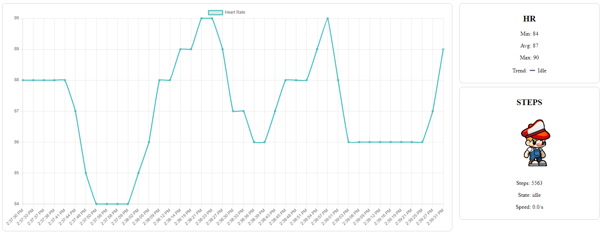
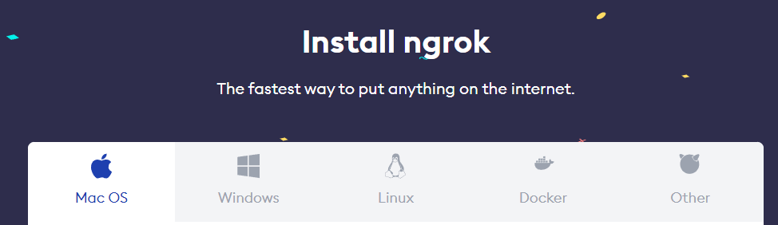

## 💡ZeppOS IRL RPG (aka webserver-data-extraction):

```js
/** Install Requirements (inside /server-nodejs folder)
 * @express npm i express
 * @bodyparser npm i body-parser
 * @websockets npm i ws
*/
```
```js
/** Setup Ngrok
 * 1. download suitable client from https://ngrok.com
 * 2. register an account
 * 3. ngrok config add-authtoken <your-auth-token>
 * 4. ngrok http 33333
 * 5. grab the server IP/port from ngrok's console and paste into your apps URL_NGROK (constants.js)
 * 6. rebuild your app
 * 7. done
 */
 ```


### Download NGROK [link](https://ngrok.com/download)

```js
/** Run the server */
ngrok http 33333
 ```